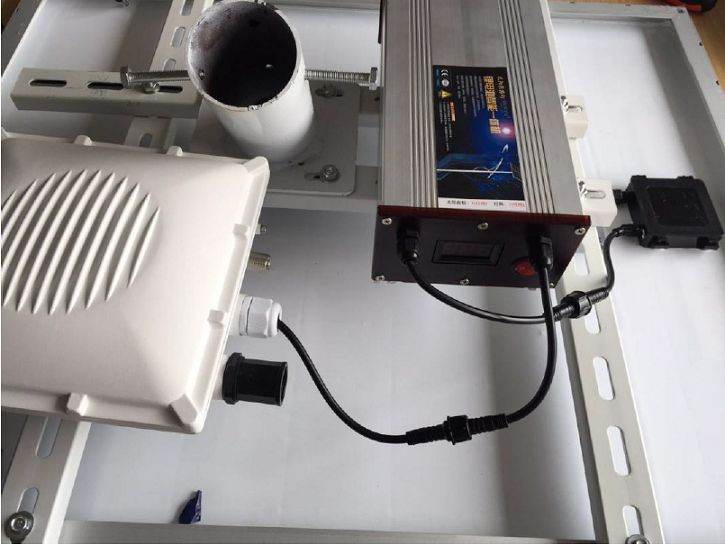
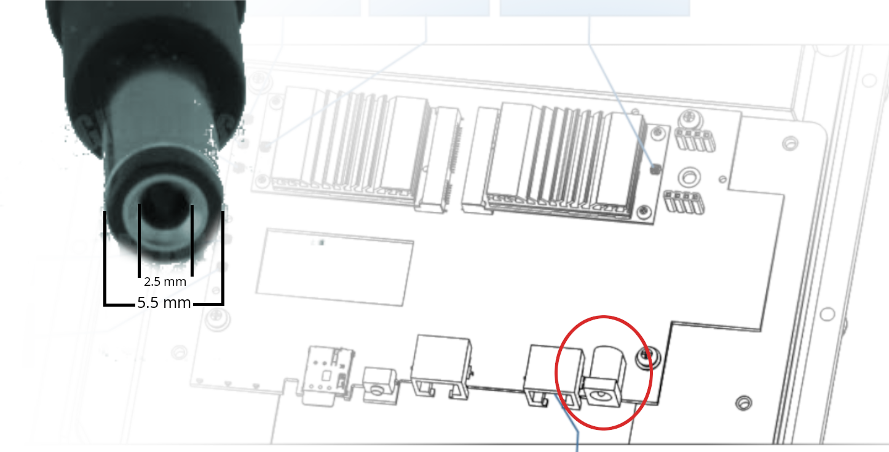

El gateway [RAK7249][rak-7249], ofrece multiples formas de operar entre ellas encontramos la posibilidad instalación de un sistema FV, esta información se puede consultar [aquí][S-FV].

## Kit de instalación Panel Solar y Batería

Este documento muestra la guía paso a paso sobre como instalar un panel solar y una batería para el 
[RAK7249][rak-7249] - Gateway Exterior. Estos pasos deben ser leídos y entendidos para evitar el daño del dispositivo.

### Especificaciones
#### Panel Solar: 
 - Potencia máxima (Pmax) 80 Vatios
 - Tensión a Pmax (Vmp) 18 Voltios
 - Corriente a Pmax (Imp) 2,2 - 5,5 Amperios
 - Tensión en circuito abierto (Voc) 21,6 voltios
 - Corriente de cortocircuito (Isc) 2,3-6,5 Amperios

#### Batería de Litio
 - Tensión nominal de salida 12,6 voltios
 - Corriente nominal de salida 2 amperios
 - Capacidad 50 Ah (Amperios-hora)
 - Tensión de carga 18 voltios

El instructivo muestra ademas un posible montaje, el cual puede consultarse en la [guía de inicio rápido][S-FV], la duración de la batería variará en función de la intensidad de la iluminación local. Para una batería de 50Ah y un panel solar de 80W, como los utilizados en el ejemplo de la documentación, el **RAK7249** - Gateway debería funcionar durante unos 4 días. Esto es en el peor de los casos, cuando hay una lluvia fuerte y constante o la presencia constante de nubes.

El siguiente ejemplo de conexión muestra panel solar, batería y Gateway, conectando el cable del terminal de salida de la batería de litio al cable de alimentación de entrada del **RAK7249** Gateway como se muestra en la siguiente figura, tomada de la [documentación][S-FV].

En este diagrama se puede observar y hacerse una idea del conector DC usado por la board **RAK7249**, el diagrama es una aproximación, esta por verificar.

[rak-7249]: https://www.rakwireless.com/en-us/products/lpwan-gateways-and-concentrators/rak7249
[datasheet-rak7249]: https://docs.rakwireless.com/Product-Categories/WisGate/RAK7249/Datasheet/
[S-FV]: https://docs.rakwireless.com/Product-Categories/WisGate/RAK7249/Quickstart/#solar-panel-and-battery-kit-installation